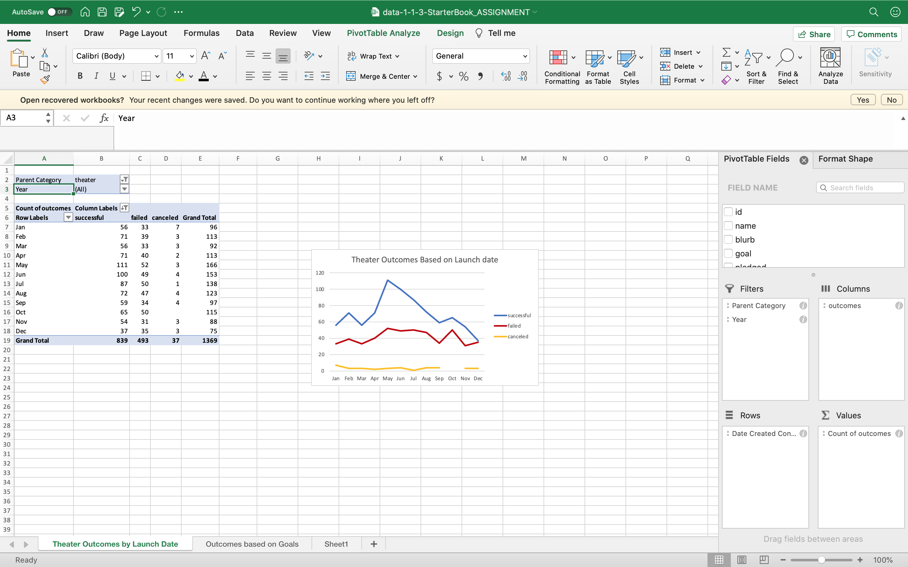
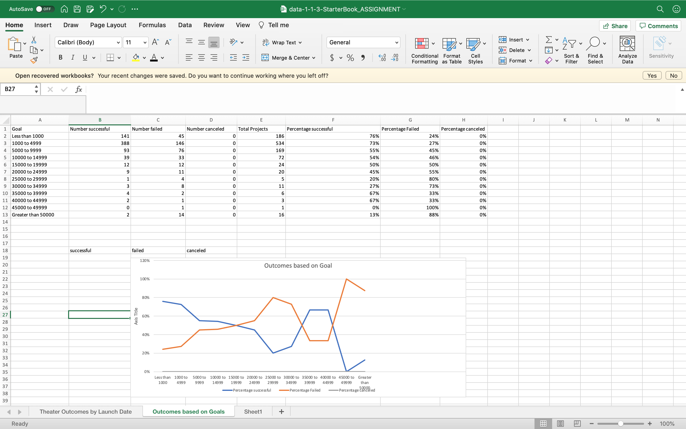

# Analysis of Louise Campaign

This analysis shows how different campaigns fared in relation to their launch dates and their funding goals. With the help of Kickstarter dataset different visulaisations have been created to undertsand the campaign outcomes based on their launch dates and their funding goals 

## Analsyis based on Launch Date :

Based on the launch date, number of campaigns which have been successful, failed, cancelled have been calculated. Using a Pivot table to the Dataset, placing the rows, coulmns and filters in appropriate position, filters have been applied to Year and Parent Category. The year have been drilled to months so the details are more specific. The filter to Parent category is set to "Theater". With these conditions to the Pivot table fields, we can see that theater campaigns have been the most successful in May and less successful in December. Theater Campaigns have failed the most in december. Intrestingly, campaigns generally dont get cancelled in October.

### Challenges which could be encountered:
The filter conditions should be checked to the desired values to get the accurate results.

### Screenshot of the Analysis based on Launch Date:
 

## Analysis based on Goals:
Baesd on the goal amount, number of campaigns which have been successful, failed, cancelled have been calculated. The Total projectsis the sum of the successful, failed, cancelled campaigns.Also the % of all these outcomes has been calculated.COUNTIFS is used to here to calculate the number of campaigns for all the goal amounts in all the outcomes in the"plays" subcategory. A line chart has been created which covers the goals, % successful, % failed, % canceled. We can see that when the goal amount<1000$ , the campaign tends to be the most successful. When the goal amount is more than 40000$, the campaign tends to fail.

### Challenges which could be encountered:

The wanted columns have to be plotted for the chart. Otherwise the chart will be formed for the entire table which leads to inaccurate values.

### Screenshot of the Analysis based on Goal:
 

## Results:

### Based on Launch date:
* We can see that theater campaigns have been the most successful in May and less successful in December. Theater Campaigns have failed the most in december. Intrestingly,    campaigns generally dont get cancelled in October. 
* The summer season looks favourable for the theater campaigns.

### Based on Goal amount:
* We can see that when the goal amount<1000$ , the "plays" campaign tends to be the most successful. When the goal amount is more than 40000$, the "plays" campaign tends to fail.

### Recommendations:
The dataset doesnt provide the information about what age group  were involved in the different category of campaigns. Having the age group information would be helpful to target better in the setting of goals and the amount received. That will also help to determine which campaign will work in different months.
